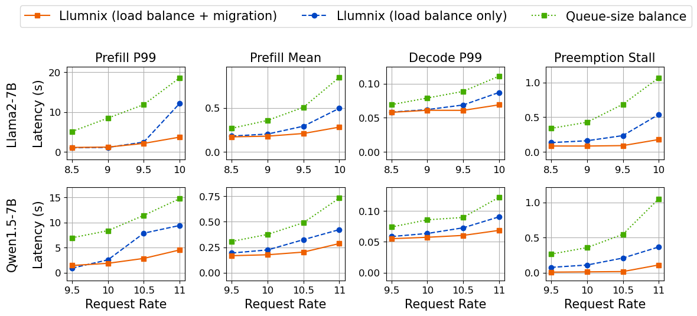

<h1 align="center">
Llumnix
</h1>

<h3 align="center">
Efficient and easy <i>multi-instance</i> LLM serving
</h3>

---

## 🔥 Latest News

- [2024.7] We officially released the first version of Llumnix!
- [2024.6] We released our OSDI '24 [research paper](https://arxiv.org/abs/2406.03243) on arxiv.

## 🚀 Why Llumnix

Llumnix is a cross-instance request scheduling layer built on top of LLM inference engines such as [vLLM](https://github.com/vllm-project/vllm).

Llumnix provides optimized multi-instance serving performance in terms of:

- *Low latency*
  - **Reduced time-to-first-token** (TTFT) and queuing delays with less memory fragmentation
  - **Reduced time-between-tokens** (TBT) and preemption stalls with better load balancing
- *High throughput* with integration with state-of-the-art inference engines

Llumnix achieves this with:

- Dynamic, fine-grained, KV-cache-aware scheduling
- Continuous **rescheduling** across instances
  - Enabled by a KV cache migration mechanism with near-zero overhead
  - Exploited for continuous load balancing and de-fragmentation

Llumnix is easy to use with:

- Minimal code changes required for vanilla vLLM deployments

- Seamless integration with existing multi-instance deployment platforms

- Fault tolerance, elasticity, and high service availability

- Extensibility to more inference engines and scheduling policies


## Getting Started

If you are already utilizing vLLM for multi-instance LLM serving deployments, simply replace the vLLM serving deployment command `python -m vllm.entrypoints.api_server ...` for each instance with the command provided below:
```
python -m llumnix.entrypoints.vllm.api_server \
    --host $HOST \
    --port $PORT \
    ...
```
During the serving deployment execution, Llumnix will automatically configure itself and serve as the request scheduling layer on top of the multiple vLLM engine instances.

Visit our [documentation](./docs/) to get started:
- [QuickStart](./docs/Quickstart.md)
- [Supported Models](./docs/Supported_Models.md)
- [Fault Tolerance](./docs/Fault_Tolerance.md)

## Performance
We evaluate the performance of the KV-cache-aware load-balancing scheduler and migration mechanism of Llumnix with 16 Llama2-7B/Qwen1.5-7B instances, each using an A10 GPU (24GB).

We use Poisson distributions with different request rates to generate request arrivals. For the input/output lengths of requests, we use ShareGPT dataset.

<div align=center>

</div>

With the KV-cache-aware load-balancing scheduler, Llumnix outperforms a simple load balancing scheduler based on queue sizes in TTFT (prefill) by up to 1.8x and 7.7x for mean and P99, and 1.4x for P99 TBT (decode).

With migration mechanism, Llumnix maintains lower preemption stalls, further outperformers load-balance scheduler in TTFT by up to 1.7x and 3.3x for mean and P99, and 1.3x for P99 TBT.

## Roadmap

Llumnix is currently in an alpha stage. Moving forward, we have work items planned including but not limited to:

- Architectural improvement: improving the scalability and efficiency of distributed serving and coordination;
- Policy optimization: better dispatching, migration, auto-scaling policies;
- New features: incorporating more inference engine features;
- Engineering: testing, CI/CD, etc.

## Publication

Please cite our paper if you use Llumnix in your research:

```bibtex
@inproceedings{sun2024llumnix,
  title={Llumnix: Dynamic Scheduling for Large Language Model Serving},
  author={Biao Sun and Ziming Huang and Hanyu Zhao and Wencong Xiao and Xinyi Zhang and Yong Li and Wei Lin},
  booktitle={18th USENIX Symposium on Operating Systems Design and Implementation (OSDI 24)},
  year={2024}
}
```

## License

Llumnix is licensed under the Apache 2.0 License.