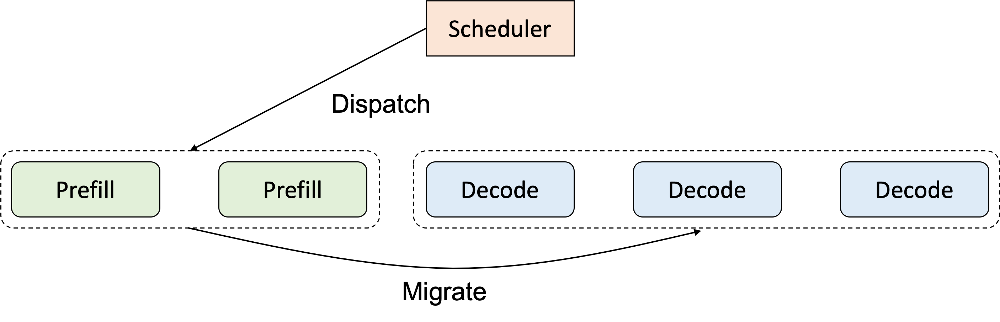
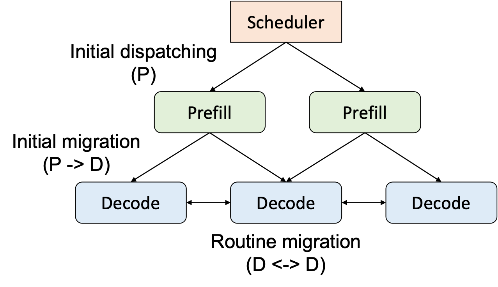

# Prefill-decode Disaggregation (Experimental)

Prefill-decode disaggregation is a technique that computes the prefill and decode phases on separate instances, designed mainly for reducing the inteference between the two phases and better utilizing heterogeneous hardware. For each request, following the prefill phase, the system migrates the generated key-value (KV) cache to the decode instance and continues the computation. 

We find Llumnix well-suited for implementing P-D disaggregation, because this technique is inherently a special request scheduling policy and fits well in Llumnix's modeling for request scheduling. Specifically, P-D disaggregation can be decomposed into two rules (shown below): (1) a special dispatching rule, i.e., P-instances-only; and (2) a special migration rule, i.e., migrate to D instances after one step. Llumnix provides an implementation of P-D disaggregation following this principle.

<div align=center>

</div>

## Benefits

Implementing P-D disaggregation in Llumnix has the following benefits.

1. **Reuses most of the system-level mechanisms**. As P-D disaggregation is a special case for our cross-instance scheduling abstraction, Llumnix has built-in mechanisms essential for P-D disaggregation from day one, e.g., KV cache transfer, decoupled API server and token forwarding, fault tolerance (for P and D instances, respectively).
2. **Non-intruisive to inference engines**. Llumnix treats all instances simply as inference engines supporting both prefill and decode. Therefore, inference engines don't need to be aware of the concepts of prefill and decode instances, making the engine implementation simpler, cleaner, and more focusing on the inference computation itself.
3. **Seamlessly integrates with Llumnix's native scheduling capabilities**. In the P-D disaggregation scheme, we still have scheduling decisions to make: which P instance to dispatch, which D instance to migrate. Llumnix's scheduling policies are readily available for them. Moreover, the migration between D instances is still helpful, e.g., for load balancing. The graph below shows the three scheduling behaviors and how Llumnix combines them.

<div align=center>

</div>

<!-- TODO(KuilongCui): add dynamic pd description -->

## Supported Features
1. Requests can be **automatically migrated** from prefill instance to decode instances.

2. Users can specify the number of prefill and decode instances.

3. Llumnix supports both one-to-many and many-to-one migrations from prefill to decode instances, e.g., when the numbers of the two types of instances are uneven.

4. Decode instances can still migrate requests among themselves based on different scheduling strategies (e.g. load-balance).

## Limitations

Currently P-D disaggregation is an experimental feature, mainly to demonstrate the feasibility of implementing it using Llumnix's abstractions. Yet, we haven't added advanced features or performance optimizations, including but not limited to:

1. Per-layer KV cache transfer (currently we use a simple blocking transfer);
2. Explicit or automatic assignment of P/D instances (currently we only allow users to specify the instance numbers, with simple assignment rules);
3. Smarter fault tolerance (currently, due to the simple P/D assignment, if one of the instance types has all of its instances gone, the service will hang; we will implement better P/D assignment and fault tolerance strategies to ensure high availability);
4. Heterogeneous instances, e.g., different device types, sizes, or parallelisms;
5. Fine tuning of the scheduling policies.

We are actively working on these items. Stay tuned :)

## How to use

### Migrating from Existing Deployments

People can launch the prefill-decode disaggregated inference service in a manner similar to the vLLM launch style. The only difference is that it is necessary to explicitly specify whether the instance to be launched is for prefill or decode. You first need follow the [Quickstart](./Quickstart.md) to configure environment variables HEAD_NODE_IP and HEAD_NODE for Llumnix. And at the same time, ensure to include `--launch-ray-cluster` in the llumnix arguments or set `SERVER.LAUNCH_RAY_CLUSTER` to True in config file. Then, follow the commands below to launch the instances:

```bash
# launch prefill instance
python -m llumnix.entrypoints.vllm.api_server --host `hostname -i` --port $PORT --model $MODEL_PATH --worker-use-ray --trust-remote-code --max-model-len 4096 --config-file configs/vllm.yml --enable-pd-disagg --instance-type prefill --initial-instances 1

# launch decode instance
python -m llumnix.entrypoints.vllm.api_server --host `hostname -i` --port $PORT --model $MODEL_PATH --worker-use-ray --trust-remote-code --max-model-len 4096 --config-file configs/vllm.yml --enable-pd-disagg --instance-type decode --initial-instances 1
```

In this deployment mode, `--instance-type` must be explicitly specified for every launch command, and `--initial-instances` will control how many instances of the corresponding type are launched. Notice that if only prefill instances exist and no decode instances are available, requests will hang in the prefill instances.

### Centralized Launch

Centralized launch assumes that users have already launched a Ray cluster. Llumnix will automatically connect to the Ray cluster and then deploy the prefill instances and decode instances according to the preset ratio. Users can submit the Llumnix launch job directly via the Ray job submission API in centralized launch mode. Below is an example of the centralized launch command:

```bash
python -m llumnix.entrypoints.vllm.serve --host `hostname -i` --port $PORT --model $MODEL_PATH --trust-remote-code --worker-use-ray --max-model-len 4096 --config-file configs/vllm.yml --enable-pd-disagg --pd-ratio 1:1 --max-instances 2
```

The `--pd-ratio` specifies the ratio of prefill instances to decode in cluster, defaulting to 1:1. `--max-instances` controls the total number of instances (including both prefill and decode). Llumnix will attempt to launch instances as closely as possible to the specified PD_RATIO of prefill and decode. And, llumnix currently provides a simple mechanism that ensures there is at least one prefill and one decode instance in the cluster.
