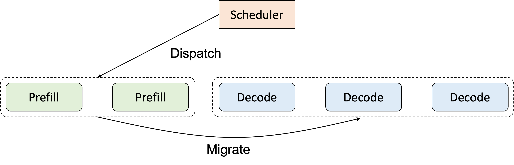
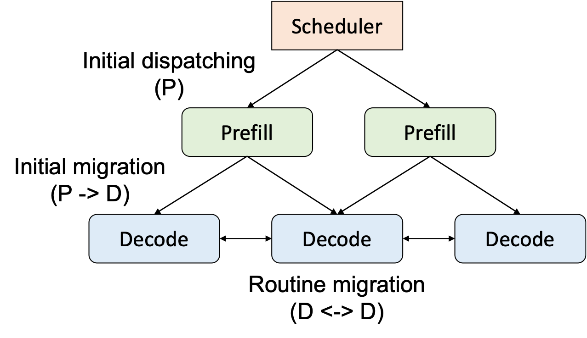

# Prefill-decoding Disaggregation (Experimental)

Prefill-decoding disaggregation is a technique that computes the prefill and decoding phases on separate instances, designed mainly for reducing the inteference between the two phases and better utilizing heterogeneous hardware. For each request, following the prefill phase, the system migrates the generated key-value (KV) cache to the decoding instance and continues the computation. 

We find Llumnix well-suited for implementing P-D disaggregation, because this technique is inherently a special request scheduling policy and fits well in Llumnix's modeling for request scheduling. Specifically, P-D disaggregation can be decomposed into two rules (shown below): (1) a special dispatching rule, i.e., P-instances-only; and (2) a special migration rule, i.e., migrate to D instances after one step. Llumnix provides an implementation of P-D disaggregation following this principle.

## Benefits

Implementing P-D disaggregation in Llumnix has the following benefits.

1. **Reuses most of the system-level mechanisms**. As P-D disaggregation is a special case for our cross-instance scheduling abstraction, Llumnix has built-in mechanisms essential for P-D disaggregation from day one, e.g., KV cache transfer, decoupled API server and token forwarding, fault tolerance (for P and D instances, respectively).
2. **Non-intruisive to inference engines**. Llumnix treats all instances simply as inference engines supporting both prefill and decoding. Therefore, inference engines don't need to be aware of the concepts of prefill and decoding instances, making the engine implementation simpler, cleaner, and more focusing on the inference computation itself.
3. **Seamlessly integrates with Llumnix's native scheduling capabilities**. In the P-D disaggregation scheme, we still have scheduling decisions to make: which P instance to dispatch, which D instance to migrate. Llumnix's scheduling policies are readily available for them. Moreover, the migration between D instances is still helpful, e.g., for load balancing. The graph below shows the three scheduling behaviors and how Llumnix combines them.

## Supported Features
1. Requests can be **automatically migrated** from prefill instance to decoding instances.

2. Users can specify the number of prefill and decoding instances.

3. Llumnix supports both one-to-many and many-to-one migrations from prefill to decoding instances, e.g., when the numbers of the two types of instances are uneven.

4. Decoding instances can still migrate requests among themselves based on different scheduling strategies (e.g. load-balance).

## Limitations

Currently P-D disaggregation is an experimental feature, mainly to demonstrate the feasibility of implementing it using Llumnix's abstractions. Yet, we haven't added advanced features or performance optimizations, including but not limited to:

1. Per-layer KV cache transfer (currently we use a simple blocking transfer);
2. Explicit or automatic assignment of P/D instances (currently we only allow users to specify the instance numbers, with simple assignment rules);
3. Smarter fault tolerance (currently, due to the simple P/D assignment, if one of the instance types has all of its instances gone, the service will hang; we will implement better P/D assignment and fault tolerance strategies to ensure high availability);
4. Heterogeneous instances, e.g., different device types, sizes, or parallelisms;
5. Fine tuning of the scheduling policies.

We are actively working on these items. Stay tuned :)

## How to use
Llumnix uses two simple arguments to enable prefill-decoding disaggregation in the current version. 
- `--enable-pd-disagg True` is used to enable prefill-decoding disaggregation.
- `--num-available-dispatch-instances` is used to configure the initial number of prefill instances. 

Note that one should make sure that `num-available-dispatch-instances` is smaller than `initial_instances` (especially when `--enable-scaling` is not set), otherwise there would be no instances for decoding.